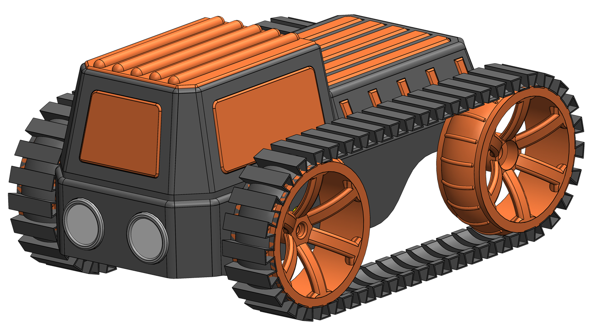

# 🤖 Engel Algılayan ve Engelden Kaçan Paletli Tank    
Bu projede, ultrasonik sensör kullanarak engelleri algılayan ve yön değiştirerek hareket eden paletli bir robot tasarlanmıştır.

Proje; Arduino Nano, L298N motor sürücü ve HC-SR04 sensör kullanılarak gerçekleştirilmiştir. Hem donanım hem de yazılım tarafı sade ve anlaşılır olacak şekilde hazırlanmıştır.
  
> 🎥 Projenin detaylı video anlatımı sayfanın en altındadır.  
  

---
## 🔧 Kullanılacak Malzemeler
### ⚡ Elektronik Malzemeler
- Arduino Nano **(1 Adet)**
- L298N Motor Sürücü Modülü **(1 Adet)**
- HC-SR04 Ultrasonik Mesafe Sensörü **(1 Adet)**
- MT3608 Boost Converter **(1 Adet)**
- 6V 250RPM DC Motor **(2 Adet)**
- TP4056 Korumalı Şarj Modülü **(1 Adet)**
- IC125B S Mini Anahtar **(1 Adet)**
- Dişi Pin Header **(1 Set)**

### 🔋 Güç Bileşenleri
- 18650 Li-ion Pil **(1 Adet)**

### 🧩 Plastik Parçalar
- 3D yazıcı ile basılmış parçalar
  - Bu projede **PLA** malzeme kullanılmıştır.
  - Pil yuvası tasarıma entegredir.

### 🔩 Vidalar
- M3x6 Vida **(6 Adet)**
- M3x22 Vida **(2 Adet)**
- M4x22 Vida **(2 Adet)**
- 2.2x6.5 Sac Vidası **(2 Adet)**

### 🧰 Diğer Malzemeler
- Plastik kelepçe (2.5mm x 150mm) **(1 Adet)** *(pil sabitlemek için)*
- Çift taraflı bant
- Bağlantı kabloları (jumper kablo vb.)

---
## 🧩 3D Baskı Bilgileri

Projede kullanılan tüm parçalar 3D yazıcı ile üretilmiştir.

- Malzeme: **PLA**
- Nozzle çapı: **0.4 mm**
- Katman yüksekliği: **0.2 mm**
- Doluluk oranı: **%20**
- Destek: Gerektiği yerlerde kullanılmıştır

Parçalar, kolay montaj ve kompakt yapı göz önünde bulundurularak tasarlanmıştır.

---
## 🎥 Video ve Detaylı Anlatım  
  
Bu projenin tüm yapım aşamaları adım adım video olarak anlatılmıştır.  
  
📌 Önizleme videosunda:  
- Projenin çalışma mantığını  
- Tamamlanmış halini  
- Temel kurulum adımlarını görebilirsiniz

> 🚀 Tüm yapım sürecini adım adım görmek için aşağıdaki videoya göz atabilirsiniz.
  
👉 [Udemy Önizleme Videosunu İzle](https://www.udemy.com/course/arduino-programlama-ve-elektronik-bilesenleri-tanma-detayl/) 
  
> Daha detaylı anlatım, devre kurulumu ve yazılım açıklamaları için Udemy kursunu inceleyebilirsiniz.
